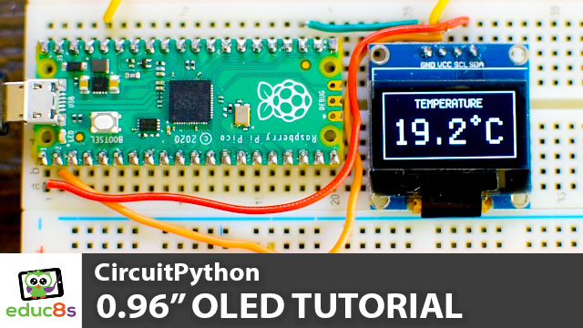

# CircuitPython SSD1306 OLED display Examples
 CircuitPython SSD1306 OLED display Examples.
 
 1. A simple "Hello World" script that displays a white frame and a "Hello World" text.
 2. A Pong Game where the CPU controls both paddles.
 3. A simple thermometer that gets the temperature from the embedded temperature sensor of the Raspberry Pi Pico board. 

  

🎥 <a href="https://youtu.be/c64WG4iJuEo">Video Tutorial on YouTube</a>

 
 

| 📺 <a href="https://www.youtube.com/educ8s">YouTube</a>
| 🌍 <a href="http://www.educ8s.tv">Website</a> |  

# Parts Needed

🛒 OLED Display ▶ http://educ8s.tv/part/OLED096

🛒 Raspberry Pi Pico ▶ http://educ8s.tv/part/RaspberryPiPico

🛒 Wires ▶ http://educ8s.tv/part/Wires

💖 Full disclosure: All of the links above are affiliate links. I get a small percentage of each sale they generate. Thank you for your support!
